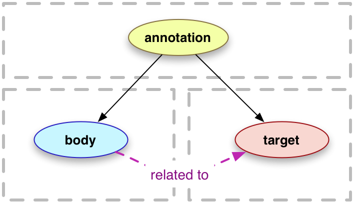

# IIIF and Linked Data

_The principles of [Linked Data](http://linkeddata.org/) and the [Architecture of the Web](http://www.w3.org/TR/webarch/) are adopted in order to provide a distributed and interoperable system. The [Shared Canvas data model](http://iiif.io/model/shared-canvas/1.0) and [JSON-LD](http://www.w3.org/TR/json-ld/) are leveraged to create an easy-to-implement, JSON-based format._ \[[Presentation API Introduction](http://iiif.io/api/presentation/2.1/)]

## Architecture of the Web

All IIIF work assumes that content and descriptions live on the web, as web resources with URIs.

  * Distribution is assumed, co-location of resources on one server is not required or assumed. 
  * Convention is minimized in favor explicit hypertext approaches where that is tractable. For example, the [paging in the Content Search API](http://iiif.io/api/search/1.0/#paging-results) uses complete URIs instead of numbers and URI templates. Exceptions include the [Image API URI structure](http://iiif.io/api/image/#image-request-uri-syntax) and [Content Search API query parameters](http://iiif.io/api/search/#request), in both cases there are description documents which identify the specification/profile that the API implements and thus allow clients to generate appropriate requests.
  * The specifications leverage standard HTTP verbs (RESTful though currently read-only pending work on a REST specification), HTTP response codes, media types, and link headers.
  * Care has been taken to work well with web caching infrastructure (e.g. different URIs for high-quality and degraded content accessible with different authorizations).

## Linked Data

Going back to Tim Berners Lee in 2006:

> Like the web of hypertext, the web of data is constructed with documents on the web. However,  unlike the web of hypertext,  where links are relationships anchors in hypertext documents written in HTML, for data they links  between arbitrary things described by RDF,.  The URIs identify any kind of object or  concept.   But for HTML or RDF, the same expectations apply to make the web grow:
>   * Use URIs as names for things
>   * Use HTTP URIs so that people can look up those names.
>   * When someone looks up a URI, provide useful information, using the standards (RDF*, SPARQL)
>   * Include links to other URIs. so that they can discover more thing

  * URIs as names/identifiers per Architecture of the Web
  * HTTP URIs which resolve used, redirects for URIs that identify non-information resources / real-world objects (whichever term you prefer).
  * Information expressed as JSON-LD, a format of RDF (more later). No requirement to use SPARQL as we do not want to tie to a particular technology stack and the complexity/performance issues of triplestores.
  * Linking within objects fundamental to IIIF. Linking between objects supported via a set of aggregate structures in the [Presenation API](http://iiif.io/api/presentation/#additional-types) and additional methods being discussed to support discovery (e.g. ResourceSync, Sitemaps).
  * Ideally, all IIIF resources would be **Linked _Open_ Data**, but this will not always be possible. Everything works best and most conveniently when open. The [Authentication API](http://iiif.io/api/auth) provides ways to leverage (multiple) auth systems in a distributed environment, and to combine restricted access content and open content.

## Shared Canvas Data Model

The [Shared Canvas data model](http://iiif.io/model/shared-canvas/1.0) is the basis of the [Presenation API](http://iiif.io/api/presentation/). 

  * Abstract data model based on RDF, does not specify particular serialization formats or interaction patterns. 
  * Introduces notion of a canvas as _"a two dimensional rectangular space with an aspect ratio that represents a single logical view of some part of the physical item"_. The canvas is separately identified from any image or the physical page.
  * Images (and other information) are _annotated_ onto the canvas.
  * Annotations follow the [Open Annotation Data Model](http://www.openannotation.org/spec/core/).

## Annotations

The foundation of the [Open Annotation Data Model](http://www.openannotation.org/spec/core/) is the notion of an annotation resource that ties the body of an annotation to the thing it is about, the target.

The [Open Annotation Data Model](http://www.openannotation.org/spec/core/) data model (2013, W3C Community Draft) has been superseded by the [Web Annotation Data Model](https://www.w3.org/TR/annotation-model/), a W3C Candidate Recommendation expected to become a Recommendation soon (final standard status from W3C). We intend to update Shared Canvas (see [#496](https://github.com/IIIF/iiif.io/issues/496), [#719](https://github.com/IIIF/iiif.io/issues/719) and then the Presentation API (v3.0) -- there will be work on this in 2017.
---

_| [Index](README.md) | [Next: Image API](image-api/README.md) |_